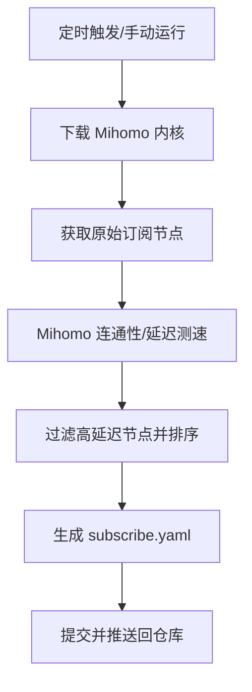

# ⚡ Clash Proxy Cleaner (GitHub Actions Edition)

<p align="center">
  
  
  
</p>

---

**Clash Proxy Cleaner** 是一个基于 GitHub Actions 的自动化工具，旨在为您提供最快、最稳定的 Clash 代理节点。它会自动从原始订阅源获取节点，通过 **Mihomo (Clash Meta)** 内核进行真实测速，过滤掉高延迟和失效节点，并按延迟重新排序，生成一份纯净的订阅文件。

## ✨ 核心特性

- 🚀 **全自动运行**：基于 GitHub Actions，无需任何服务器部署。
- 🕒 **定时更新**：每天伦敦时间 00:00 准时自动清洗。
- ⚡ **真实测速**：使用 Mihomo 内核进行实际连通性测试，拒绝虚假节点。
- 🌍 **智能命名**：自动识别节点所属国家/地区，并为节点添加 GeoIP 标识。
- 📊 **延迟排序**：自动将节点按延迟从低到高排序，保证首选节点最快。

## 🛠️ 工作原理



## 🚀 快速上手

### 1. 配置订阅源
在您的 GitHub 仓库设置中添加 **Secret**：
- 前往 `Settings` -> `Secrets and variables` -> `Actions` -> `New repository secret`。
- 添加 **`PROXY_URLS`**：填入您的原始订阅链接，多个链接请用逗号 `,` 分隔。

### 2. 获取清洗后的订阅
配置完成后，您可以使用以下地址直接在 Clash 中使用清洗后的订阅：

```bash
https://raw.githubusercontent.com/您的用户名/您的仓库名/main/subscribe.yaml
```

## ⚙️ 自定义配置

您可以直接编辑 [clean-proxies.yml](.github/workflows/clean-proxies.yml) 来调整以下参数：

| 环境变量 | 说明 | 默认值 |
| :--- | :--- | :--- |
| `MAX_LATENCY` | 允许的最大延迟 (ms)，超过此值的节点将被移除 | `1500` |
| `CRON` | 自动触发频率 (Cron 表达式) | `0 0 * * *` (每天一次) |

---

<p align="center">
  如果这个项目对您有帮助，欢迎给个 ⭐️ <b>Star</b> !
</p>
